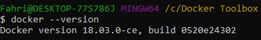
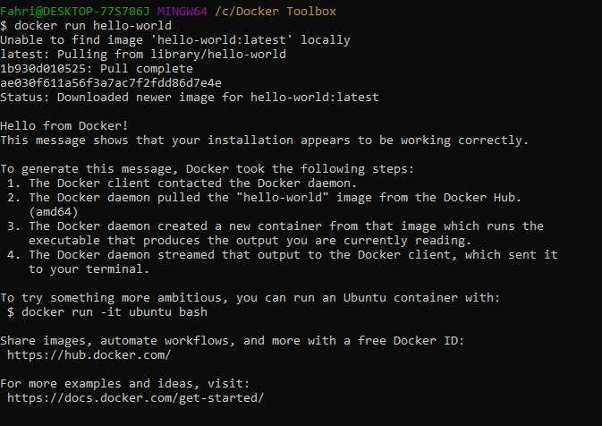
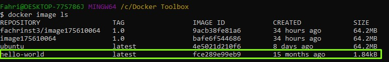
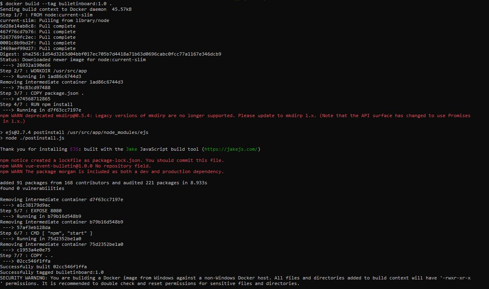
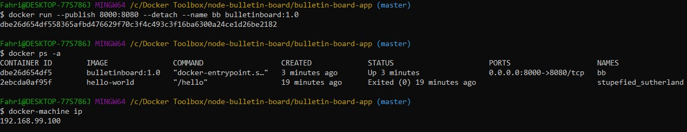
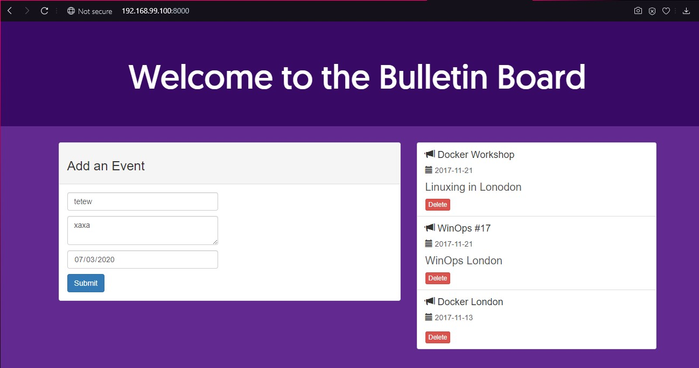
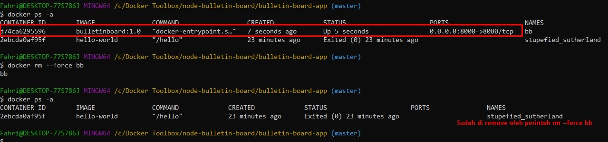
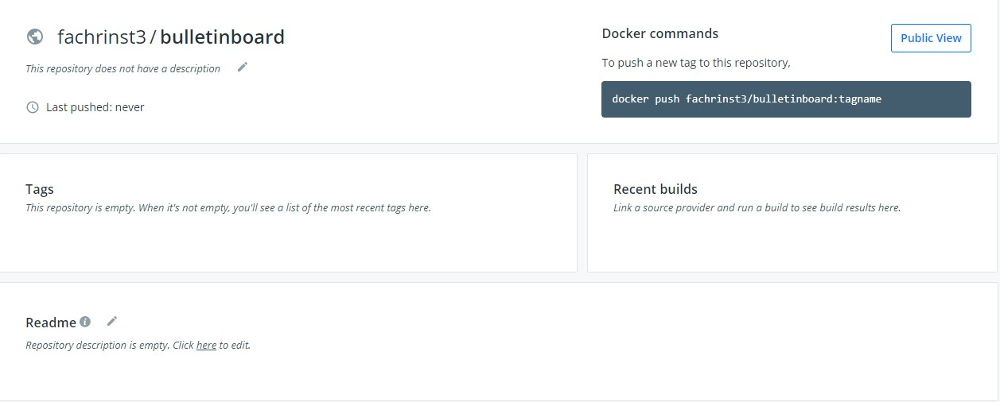
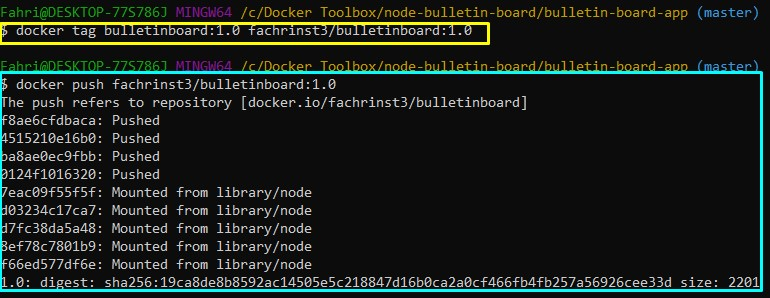
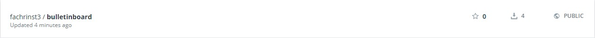

<h1>Latihan Praktikum TCC Minggu-07 </h1>

1. Melakukan pengecekan versi docker sesudah melakukan instalasi.

2. Melakukan run image docker hello-world

3. Melakukan pengecekan terhadap image yang sudah didownload ke machine.

4. Melakukan build terhadap image buletin yang sudah diclone ke lokal melalui git sebelumnya. 

5. Melakukan run, cek ip machine dan membukanya di browser.

berikut hasil di browser.

6. Memberhentikan container yang sedang jalan, dan menghapusnya dari list container

7. Untuk melakukan push terhadap image ke dockerhub sebenarnya dapat dilakukan melalui full command line, akan tetapi karena ini tutorial kita ikuti saja.

8. Pertama membuat repo di dockerhub

9. Lalu melakukan perubahan terhadap nama image yang sesuai dengan persyaratan share di dockerhub(kuning). Lalu menggunakan perintah push untuk melakukan push image kedalam repo akun kita(biru).

10. Hasil dari kedua proses diatas dapat kita cek di repo akun dockerhub. 

