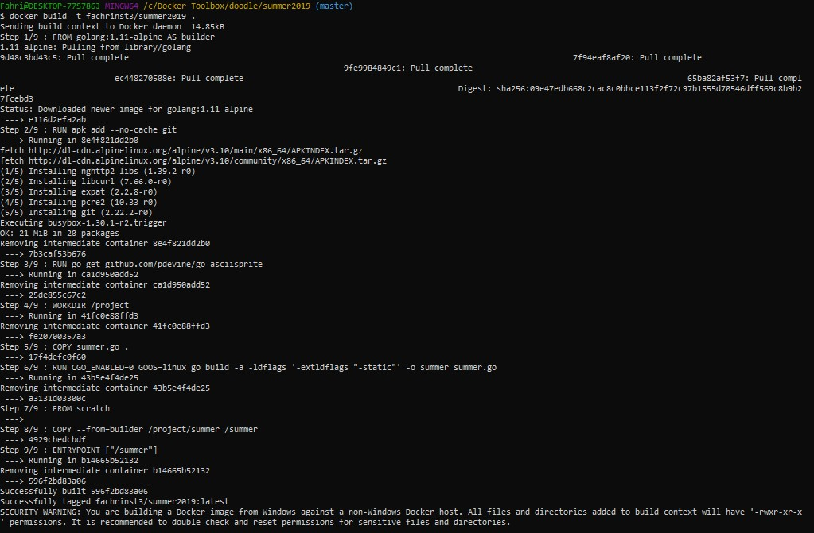
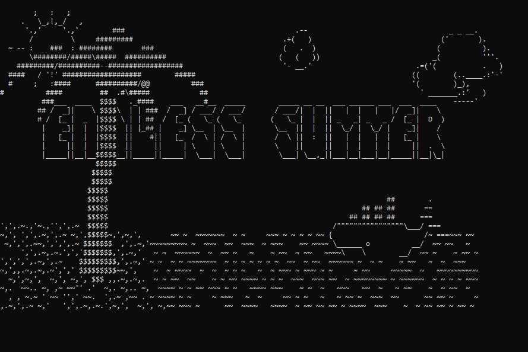

<h1> Tugas Praktikum-TCC minggu 7 (Cari image yang menarik bagi saya) </h1>

1. Saya memilih image doodle (alpine), dengan tema summer(menampilkan ASCII art di terminal ketika dijalankan).

2. Setelah melakukan clone terhadap image yang saya gunakan, kita langsung masuk ke direktorinya dan melakukan build terhadap dockerFilenya.

3. Karena image ini di dockerFilenya hanya berisikan perintah untuk menampilkan ASCII art maka kita tidak cukup melakukan run tanpa menggunakan shorthand port untuk menampilkannya pada localhost (karena di file dockernya juga tidak terdapat exec di localhost)

