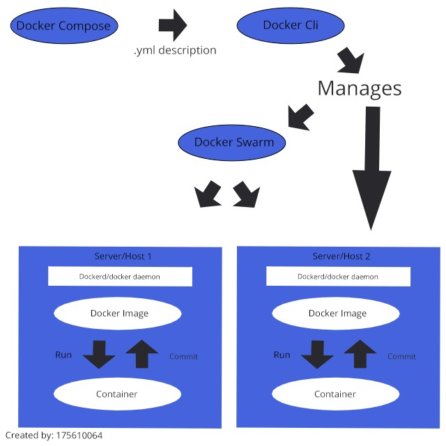

# Tugas TCC-minggu 8

## Note :
Diagram diatas saya buat berdasarkan pengalaman saya dalam proses penggunaan docker, serta referensi dari dokumentasi docker. Docker Cli berguna untuk memanajemen perintah build, run, dan pull terhadap dockerimage dengan menggunakan dockerd/docker daemon. Jika menggunakan fitur docker compose maka terdapat penambahan berupa file .yml(berisi baris deskripsi) seperti yang sebelumnya dikerjakan pada latihan. Ketika user menggunakan fitur docker swarm maka akan menjalankan multi cluster sehingga terdapat 2 host didalam diagram(untuk proses manajer tidak saya jelaskan disini karena hanya diagram yang menggambarkan keterkaitan). Pada penggunaan swarm, docker cli tidak langsung memanajemen sebuah server/host secara langsung melainkan melalui swarm service karena pada dasarnya digunakan untuk memanajemen lebih dari satu container, dan lebih dari satu server/host.

feedback : fachri460@gmail.com

