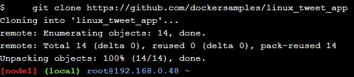
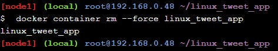

<h1> Latihan TCC-minggu 9 </h1>

<h2> A. Run a single task in an Alpine Linux container </h2>

1. Melakukan Clone tweet app dari repo di Github.

2. Melakukan run container linux alpine secara single task

3. Melakukan cek terhadap container yang dijalankan sebelumnya dengan nama "hostname".

<h2> B. Run an interactive Ubuntu container</h2>

1. Menjalankan container interaktif ubuntu dan menggunakan perintah dasar linux didalamnya. Karena menjalankannya menggunakan perintah --rm maka ketika dicek pada list container ubuntu tidak akan terdaftar (langsung dihapus ketika diberhentikan).

2. Lalu kita melakukan pengecekan versi dari virtual machinenya.

<h2> C. Run a background MySQL container</h2>

1. Penggunaan perintah untuk menjalankan container Mysql di background.

2. Melakukan pengecekan terhadap container yang berjalan di background menggunakan perintah docker untuk melihat list container.

3. Menggunakan perintah docker untuk melihat proses yang berjalan di container.

4. Menggunakan perintah docker untuk membuka shell didalam container yang berjalan dibackground untuk melakukan cek versi mysql-nya.

<h2> D. Package and run a custom app using Docker</h2>

1. Masuk ke direktori linux tweet-app yang sebelumnya di clone, dan membuat DockerFile yang menggunakan image nginx.

2. Melakukan export environment variabel yang isinya id dockerhub kita.

3. Melakukan build image yang sebelumnya sudah disiapkan.

4. Melakukan run terhadap image, dan melihat hasilnya dibrowser.

5. Memberhentikan container-nya menggunakan perintah force, dan melakukan cek apakah berhasil.

<h2> E. Modify a running website</h2>

1. Pertama kita menjalankan container pada task sebelumnya (tweet app), akan tetapi kali ini container di mount untuk proses terhadap task ini.

2. Lalu kita menambahlan file html didalam direktori tweet-app, dan melakukan cek terhadap perubahan di website tweet-app yang berjalan.

3. Meskipun kita telah memodifikasi index.html sistem file lokal dan melihatnya berubah didalam container yang sedang berjalan, kita belum benar-benar mengubah image Docker dicontainer tersebut (karena menggunakan mount), maka kita melakukan pemberhentian container, dan melakukan start ulang, dan hasilnya image tidak berubah sama sekali.

4. Kita akan melakukan modifikasi(update) terhadap image tweet-app dan menggunakan tag 2.0 didalam proses build ulangnya. Dan melihat hasilnya di list container.

5. Lalu kita melakukan run (yang didalam direktorinya kita sudah menggunakan file html yang di update sebelumnya), dan melihat hasilnya.

6. Lalu untuk perbandingan terhadap image baru, dan lama kita akan menjalankan container lain dengan port berbeda, yaitu 80-8080 (karena yang baru sudah berjalan di port 80-80), dan nama containernya adalah old linux tweet app. Lalu melihat image yang lama di port tersebut.

7. Lalu kita akan melakukan push terhadap 2 image yang sudah kita buat didalam proses tutorial ini, yaitu tweet app 1.0, dan tweet app 2.0 .

8. Sebelum push kita harus melakukan login, karena sebelumnya sudah login saya langsung menadapatkan feedback ini.

9. Lalu melakukan push ke repo dockerhub di akun saya.

10. Dan berikut adalah hasil dari push ke repo dockerhub saya. 

