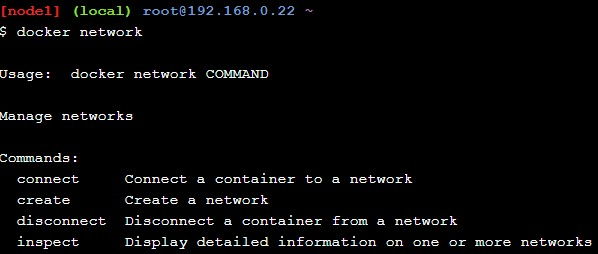
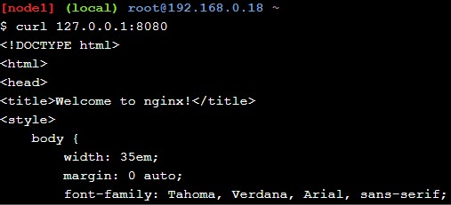

<h1> Latihan TCC-minggu 10  </h1>

<h2> Docker Networking Hands-on Lab </h2>

<h3> A. Networking Basics </h3>

 1. Menggunakan perintah "docker network" untuk melihat command yang dapat digunakan untuk mengelola networking di container

 

 2. Menggunakan perintah "docker network -ls" untuk melihat list network docker yang ada di docker host yang saya gunakan.

 

 3. Menggunakan perintah inspect yang ada di docker network untuk melihat detail konfigurasi dari network yang memiliki nama bridge.

 

 4. Menggunakan perintah "docker info" untuk melihat informasi mengenai docker yang ter-install di vm yang saya gunakan, dari perintah ini dapat dilihat plugin networknya.

  

<h3> B. Bridge Networking </h3>

 1. Melakukan cek terhadap network container bridge di list menggunakan "docker networking -ls"
 
 

 2. Lalu melakukan update, dan menambahkan command bridge control ke linux vm yang saya gunakan.

 

 

 3. Selanjutnya adalah menghubungkan container, pertama kita melakukan run terhadapa container yang berjalan di background.

 

 

 Lalu menggunakan perintah bridge control untuk melihat bahwa container yang baru di run sudah otomatis menjadi interface dari bridge docker0.

 

 Selanjutnya melakukan tes konektivitas terhadap container baru yang aktif di background melalui ping ke ip yang sebelumnya sudah diketahui menggunkan perintah inspect.

 

 Lalu untuk memastikan bahwa container dapat terhubung ke jaringan luar kita menjalankan shell linux di container yang berjalan dibackground, dan menginstall program untuk melakukan ping ke github.com.

 

 4. Selanjutnya kita akan melakukan konfigurasi NAT untuk koneksi external, pertama kita melakukan run terhadap container yang menggunakan image nginx.
 
 

 
 

 <h3> C. Overlay Networking </h3>

 1. Melakukan inisiasi docker swarm

 

 lalu menyalin output token ke terminal kedua dan bergabung ke node worker
 
 

 Dan melakukan cek apakah keduanya sudah berada pada satu swarm(dicek melalui swarm manager yaitu terminal1/node1).
 
 

 2. Lalu melakukan pembuatan overlay network dengan nama overnet.

 

 menjalankan perintah untuk melihat list network pada node2/terminal2 dan hasilnya overnet tidak kelihatan karena Docker hanya memperluas network overlay ke host ketika diperlukan. Ini biasanya ketika host menjalankan tugas dari layanan yang dibuat di network.
 
 

 3. Selanjutnya membuat service dengan nama myservice, dan memastikannya sudah menjalankan task untuk mereplika berjalan dikedua node.

 

 
 
 Karena sudah berjalan didua node maka overnet akan ditampilkan ketika melihat list network pada node2/terminal2.

 

 4. Lalu untuk melakukan tes bahwa node1, dan node2 terhubung kita menggunakan shell di container myservice2(pada node1), dan melakukan ping ke myservice1(pada node2).
 
 
  
 5. Dan yang terakhir kita akan melakukan tes ping melalui shell ke service myservice yang sudah kita buat.

 

