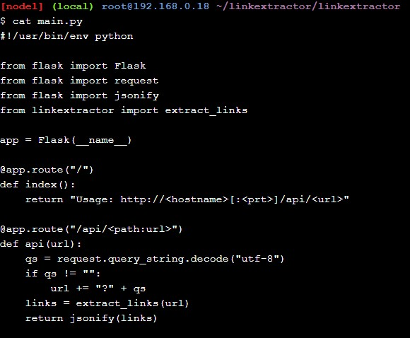

<h1> Latihan TCC-minggu 11 (microservice-orchestration) </h1>

<h3>A. Basic Link Extractor Script </h3>
 
 1. 
 

 2. 
 

 3. 
  

 4. 

<h3>B. Containerized Link Extractor Script </h3>

 1. 

 2. 

 3. 

 4. 

 5. 

<h3>C. Link Extractor Module with Full URI and Anchor Text </h3>

 1. 

 2. 

 3. 

 4. 

 5. 

 6. 

<h3>D. Link Extractor API Service </h3>

 1. 

 2. 

 3. 

 4. 

 5. 

 6. 

 7. 

<h3>E. Link Extractor API and Web Front End Services </h3>

 1. 

 2. 

 3. 

 4. 

 5. 

 6. 

<h3>F. Redis Service for Caching </h3>

 1. 

 2. 

 3. 

<h3>G. Swap Python API Service with Ruby </h3>

 1. 

 2. 

 3. 

 4. 

 5. 

 6. 

